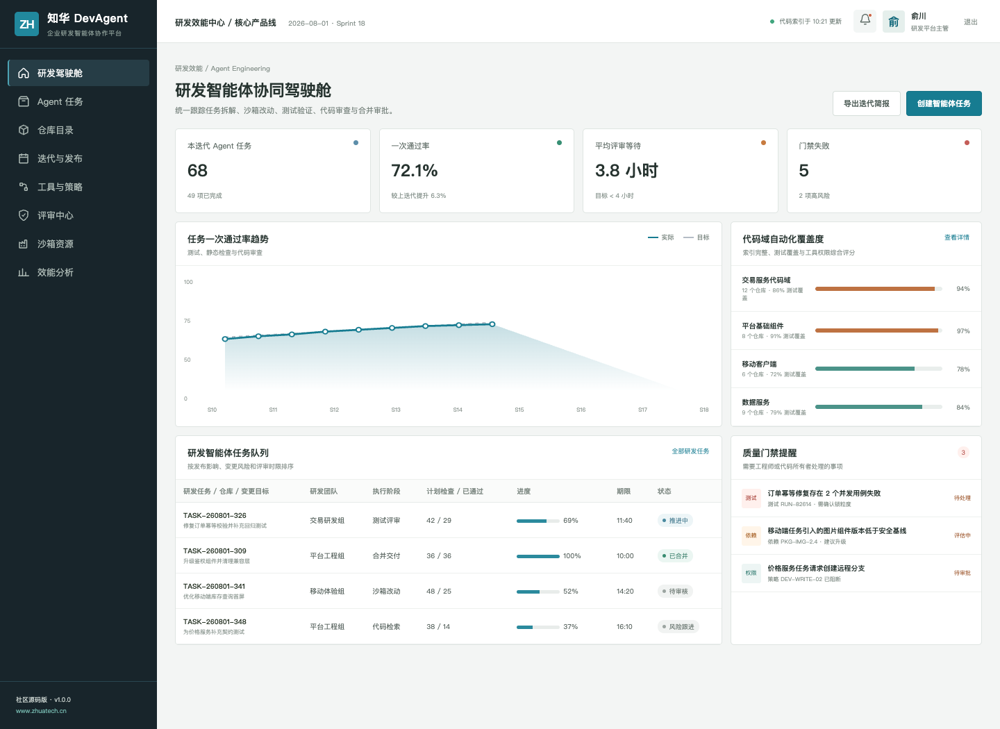
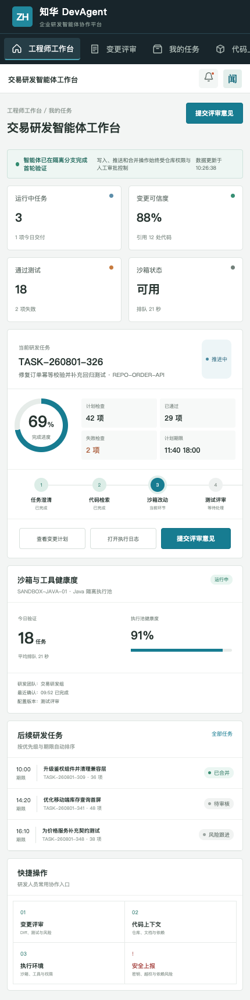

# ZhuaTech DevAgent｜企业研发智能体协作平台

> 从任务澄清到可验证改动：所有代码动作发生在受控边界，推送与合并仍由工程师决定。



## 产品地图

```text
Issue / 需求
  └─ 任务澄清与计划
      └─ 仓库检索与影响分析
          └─ 隔离分支改动
              └─ 测试、静态检查、评审
                  └─ 人工批准推送与合并
```

ZhuaTech DevAgent 社区源码版提供仓库目录、Agent 任务、沙箱资源、工具策略、变更评审、质量门禁和研发效能分析。演示模式不会访问外部 Git 仓库，也不包含模型密钥。



## 功能清单

1. 任务拆解、上下文检索、改动计划与风险提示。
2. 只读仓库工具、隔离执行环境和最小权限策略。
3. 单元测试、契约测试、静态扫描与失败证据。
4. Diff 评审、CODEOWNERS 审批与合并控制。
5. 成功率、一次通过率、评审等待与返工分析。
6. 可插拔 `AgentRuntime`，便于在授权环境接入模型与内部工具。

变更风险门禁对改动文件数、测试覆盖率、严重漏洞、数据库迁移和回滚方案进行统一评估。存在严重漏洞或数据库变更缺少回滚证据时直接阻断，其他高风险变更进入人工评审，结果可作为创建合并请求前的确定性检查。

## 开发运行

- 后端：Java 21 / Spring Boot / Security / JWT / JPA / Flyway，包名 `cn.zhuatech.devagent`
- 前端：Vue 3 / Pinia / Vue Router / Axios / Vite，响应式 H5
- 数据库：MySQL 8；测试：H2

执行 `cd frontend && npm install && npm run dev:demo` 后访问 `http://localhost:5173`。演示账号为 `planner / Demo@2026`（研发管理端）和 `operator / Demo@2026`（工程师端）。更多内容见[架构说明](docs/architecture.md)、[API 文档](docs/api.md)和[部署指南](deploy/README.md)。

## 开放范围不是商业授权

本工程只可用于个人学习、研究和非商业技术交流，**不得商用**。企业内部生产部署、项目交付、SaaS、收费服务、代码再销售、品牌替换等必须取得上海如静知华信息科技有限公司书面授权，具体以 [LICENSE](LICENSE) 为准。

深度开发、私有化部署、Agent 工具链集成或商业授权，请访问[知华科技官网](https://www.zhuatech.cn/)或扫码咨询。

| 微信咨询一 | 微信咨询二 |
| --- | --- |
|  |  |

SEO：研发智能体源码、Coding Agent、软件工程 Agent、代码评审 AI、研发效能平台、Java Vue 开源项目、知华科技。
